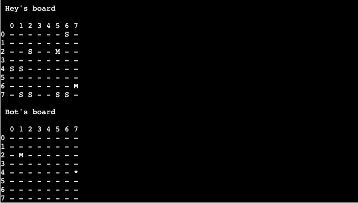

<h1 align="center" style="font-size: 250%;"><b>
Battleships Terminal Game
</b></h1>

[Check the live project here!](https://battleships-terminal-game.herokuapp.com/)

---
## **How to play**
---

This game is based on the classic [Battleships game](https://en.wikipedia.org/wiki/Battleship_(game)).

When the game starts an info area is displayed at the top, containing info about the game. The player is then prompted to enter a name. The boards are drawn up and the player can now enter co-ordinates.

The player can see their ships, marked with an **S**, on their board. The computer ships are hidden.
Hits are marked with __*__ and misses with **M**.

---
## **Features**
---

- Info
    - At the top of the game there's info on how the game is set up.
    

- Random ship generation on the game board
    - Ships are placed randomly on both the player and computer board.
    - The computer ships are invisible to the player.
    - Marks the player board with ships. Hits and misses are displayed for both boards.

- Turn based
    - The game is turn based.
    - There's 16 rounds in total.
    - Rounds are updated and displayed after each turn.

- Input validation
    - Player can choose any name. It's capitalized when referenced.
    - When entering co-ordinates for the board, only __whole numbers__ within the board size are valid.
    - The player is informed of any input errors, like entering the same co-ordinates (numbers) twice.

### **Unimplemented features**

- Player and computer scores
    - When all ships on either board has been sunk, declare a winner.
    - When rounds are over, check which player has sunk the most ships. Declare a winner based on highest score or a tie.

---
## **Data Model**
---

The data chosen for this project is a class. The class is called Board and holds everything for the application to run.
It creates two boards, one for the player and one for the computer.

It stores everything from guesses, number of ships, the positions of ships, player name and to whom which board belongs.

It contains all the methods to make the game function properly, like adding ships and prompting the player for input.

---
## **Technologies**
---

### **Languages**

-   [Python](https://www.python.org/)

### **Programs**
1.  [Gitpod](https://gitpod.io)
    - Gitpod was used to host a virtual workspace.
2.  [PyCharm](https://www.jetbrains.com/pycharm/)
    - PyCharm was used to write all code. It's specialized towards Python which eased development.
3.  [Git](https://git-scm.com/)
    - Git was used for version control by utilizing the Gitpod terminal to commit Git and Push to GitHub.
4.  [GitHub](https://github.com/)
    - GitHub is used to store the project code after being pushed from Git.
5.  [Heroku](https://www.heroku.com/home)
    - Heroku is used to host the mock terminal.

---
## **Testing**
---

I have tested the code manually and through the PEP8 linter.

[PEP8 linter](http://pep8online.com/)

- Validated inputs by entering letters and numbers outside the accepted range.

[Am I Responsive?](http://ami.responsivedesign.is/?url=https://jfrdrkssn.github.io/first-project-ci/index.html)

### **Resolved bugs**

Entering 8 when prompted for input (accepted range 0-7) returned an error. Solved by reducing the range of numbers accepted by 1. This was caused by zero-indexing. 

---
## **Deployment**
---

### **Heroku**

The project was deployed to Heroku using the following steps...

1. Log in to Heroku and create a new application.
2. Go to the "Settings" tab.
3. Add the following buildpacks in this order.
    1. heroku/python
    2. heroku/nodejs
4. Link [this repository](https://github.com/JFrdrkssn/third-project-ci) with the Heroku application.
5. Choose "Automatic Deployment" or "Manual Deployment".

---
## **Credits**
---

### **Code**
- The code is based on [Code Institute's](https://codeinstitute.net/) school curriculum. It's from a video where a tutor shows an example of a simple Battleships game in Python.

### **Acknowledgements**

- My Mentor, Gerard McBride, for continuous helpful feedback and support.
- Fellow student Patrik Österljung, for peer review of code and insightful tips. [GitHub](https://github.com/oljung)